# 🎵 Music Streaming Platform

A web application that allows users to listen to music online,
interact with other users, manage playlist,....

## 🚀 Features
- 🎧 Stream and play music
- 🔍 Search and filter songs
- 📊 View music rankings
- 💬 Social interactions (like, share, comment)
- 🚩 Report inappropriate content
- 👤 User authentication and account management
- 🛠 Admin dashboard for managing songs, artists, and reports

## 📸 Screenshots
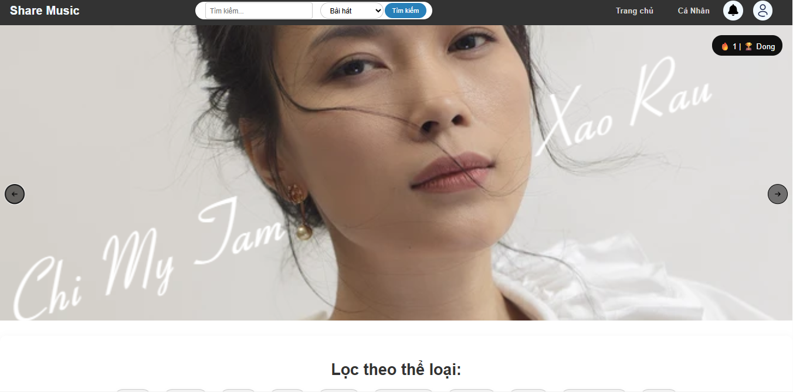
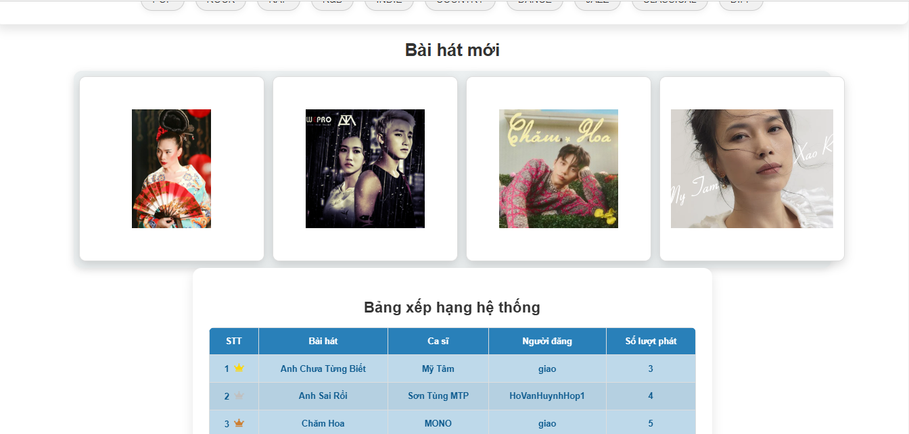
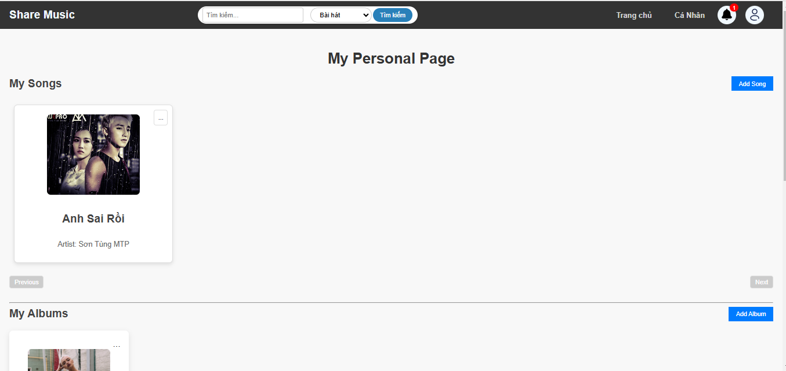
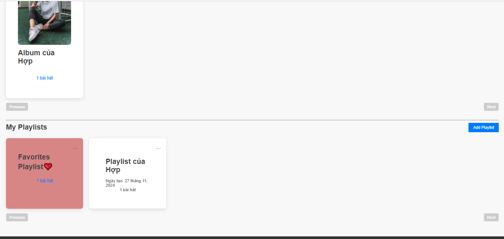
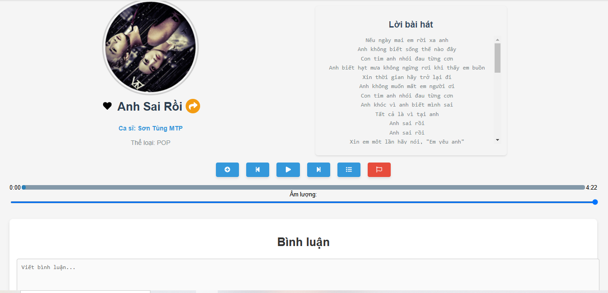
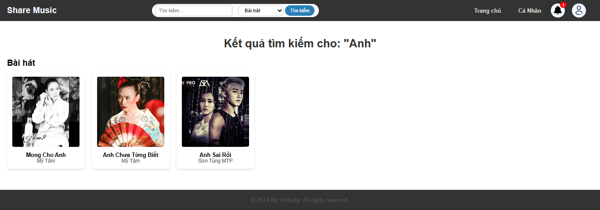
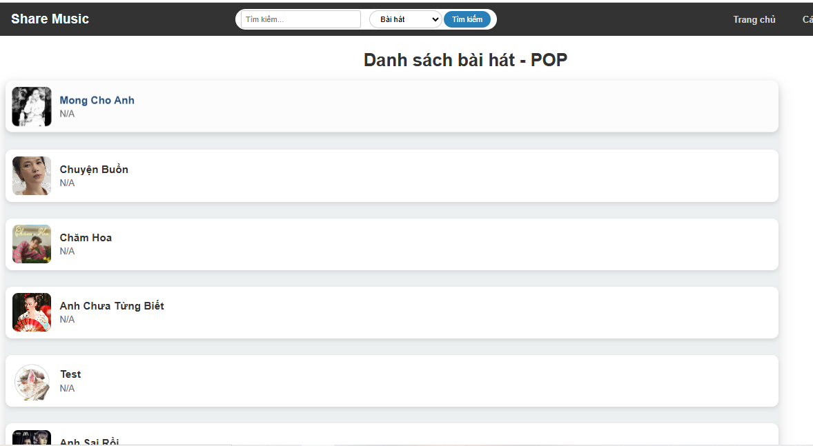
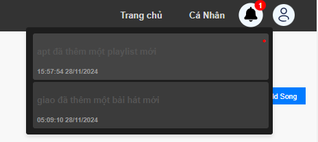
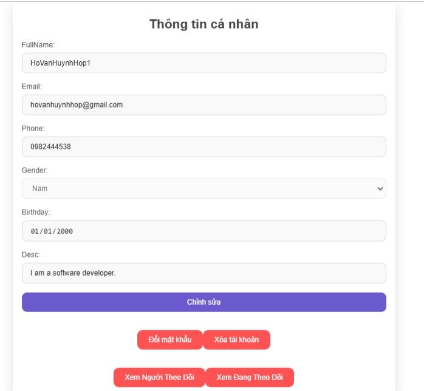
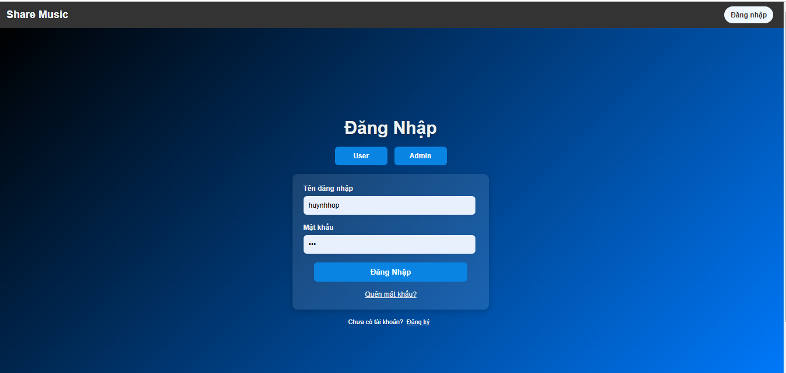
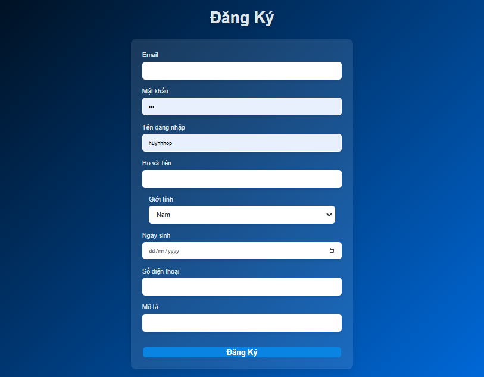
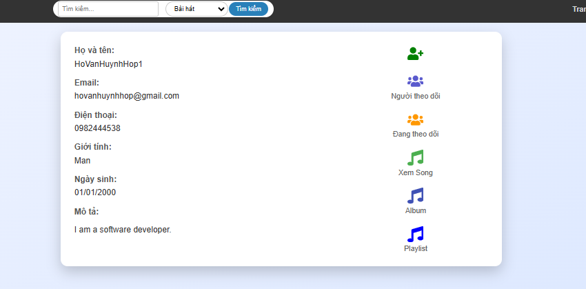
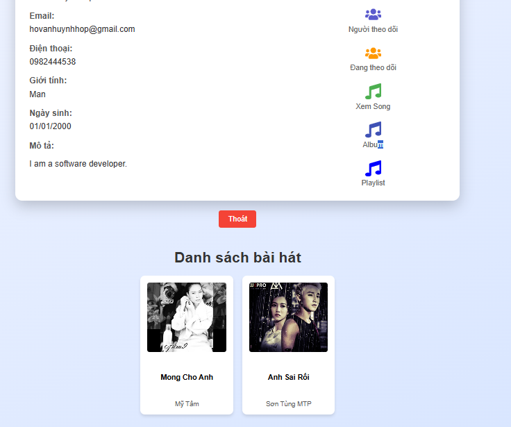
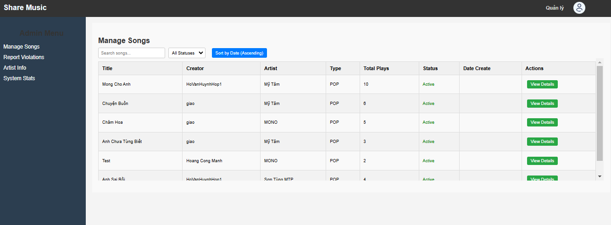
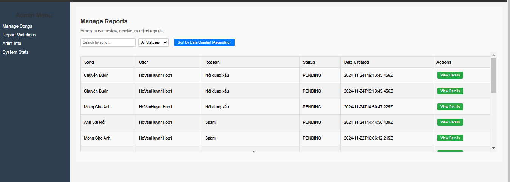
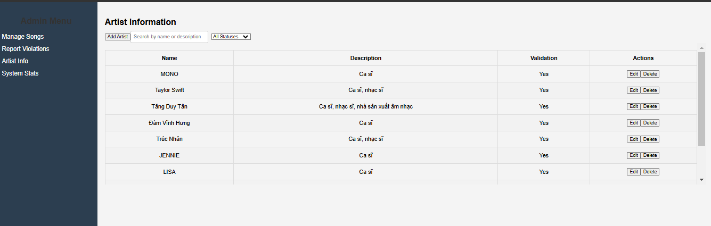
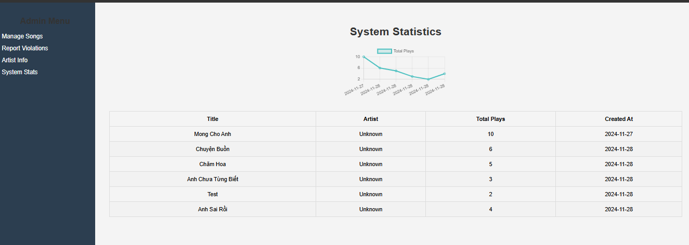

## 🛠 Tech Stack
- React
- Node.js
- Express
- MongoDB
- JWT
- Socket

## 👨‍💻 Author
HuynhHop
QuynhGiao
CongManh
CamHanh
